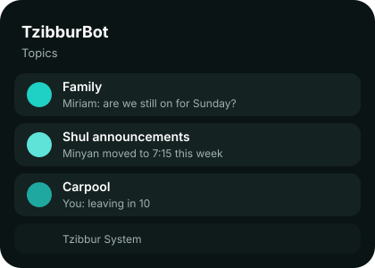

<p align="center">
  
</p>

<p align="center">
  <a href="https://github.com/TripleU613/UnTzibburBot/actions/workflows/ci.yml"></a>
  <a href="https://github.com/TripleU613/UnTzibburBot/actions/workflows/deploy.yml"></a>
  <a href="LICENSE"></a>
  
</p>

<p align="center">
  A Telegram client for <a href="https://tzibbur.me">Tzibbur</a>.<br>
  Every group you belong to becomes a topic in one chat. Read there, reply there.
</p>

---

## Use it

1. Open **[@TzibburBot](https://t.me/TzibburBot)** and send `/start`.
2. Send `/connect` and your phone number. Tzibbur texts you a code; send it back.
3. Your groups appear as topics. Type in a topic to post to that group.

<p align="center"></p>

Inside a topic, `/group` manages the group: members, permissions, rename, leave. `/newgroup` creates one. `/help` lists everything.

## Privacy

The bot relays messages; it does not keep them. Message text is erased the moment it is delivered. What stays is ids, topic mappings, and your Tzibbur session, encrypted, so the bot can stay connected for you. `/privacy` in the bot says the same. No emojis, no tracking, no ads.

## Run your own

```sh
cp .env.example .env          # bot token, database secrets, one master key
docker compose up -d --build
```

One image, Postgres and Directus alongside. Enable **Threaded Mode** for your bot in @BotFather so topics work in private chats. Everything else is in [DEVELOPMENT.md](DEVELOPMENT.md).

## Built with

Rust, [teloxide](https://github.com/teloxide/teloxide), [Directus](https://directus.io), and a from-scratch Tzibbur client ([`crates/tzibbur-api`](crates/tzibbur-api)).

<p align="center"><sub>MIT licensed. Not affiliated with Tzibbur.</sub></p>
